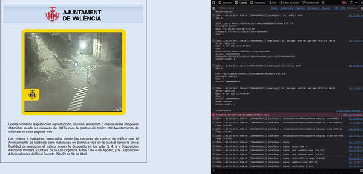
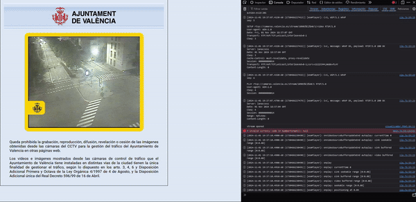

# Valencia Surveillance Camera Stream Keeper

## Overview

Valencia Surveillance Camera Stream Keeper is a browser extension that allows users to bypass the 20-second limit on the live stream of Valencia's surveillance cameras.

## Installation

### Chrome

1. Clone or download this repository.
2. Open Chrome and navigate to `chrome://extensions/`.
3. Enable "Developer mode" using the toggle in the top right corner.
4. Click "Load unpacked" and select the directory containing this extension's files.

_certainly i don't know if i'll publish this in the Chrome Web Store since they want me to pay 5 dollars lol, sorry not sorry_

### Firefox

Can be installed [via Firefox Add-ons](https://addons.mozilla.org/es/firefox/addon/valencia-cameras-stream-keeper) or by the following:

1. Clone or download this repository.
2. Open Firefox and navigate to `about:debugging#/runtime/this-firefox`.
3. Click "Load Temporary Add-on" and select the `manifest.json` file from this extension's directory.

## Usage

Once installed, the extension will automatically bypass the 20-second limit on the live stream of Valencia's surveillance cameras when using [their web app](https://geoportal.valencia.es/portal/apps/webappviewer/index.html?id=3a302533ea51497f9a2af6b723cc9495) and being redirected to URLs in the form `https://camaras.valencia.es/camaras/visualizador.html?id=*`.

  <figure style="display: inline-block; margin: 10px;">
    
    <figcaption>Without bypasser</figcaption>
  </figure>
  <figure style="display: inline-block; margin: 10px;">
    
    <figcaption>With bypasser</figcaption>
  </figure>

## License

This project is licensed under the MIT License.
